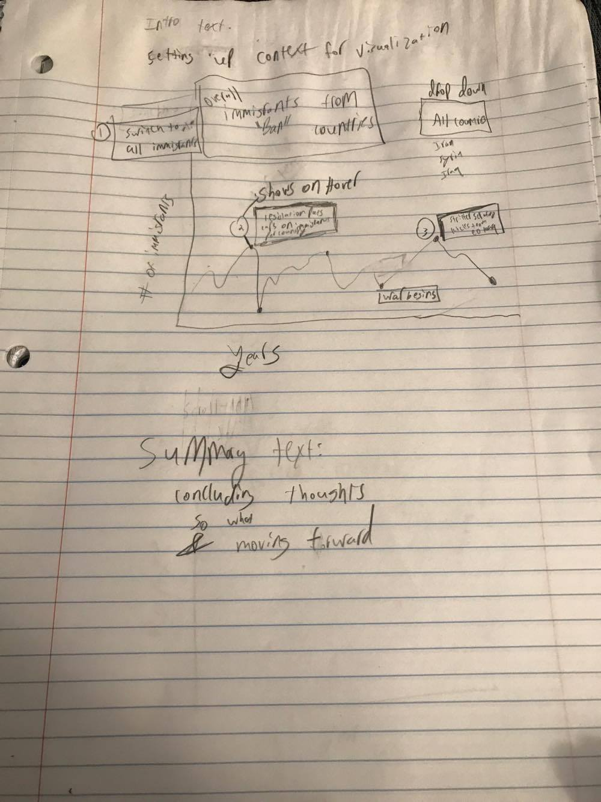

## Iman Baghai
# R4

# Annotated Chart

The second deliverable is a written description of the visual narrative
elements and narrative structures used (50 points).
For each visual narrative element and narrative structure included,
you should write a 1 - 2 sentence defense of why you included it,
and how they amplify the interpretability of your story.
 For a full set of elements broken down into sub-categories, see Figure 7
 (make sure you understand this taxonomy!).

**Visual narrative Elements:**

 Consistent Visual Platform:

>By maintaining a consistent chart that the user is able to alter by clicking
either the button to change from raw numbers to percentage or from all countries
to a specific country, the user doesn't need to rethink how the platform
should be interpreted. This means the user only has to learn how the chart works once
and then continue to learn and interact with the chart from there.
This is consistent with the martini structure where there is some beginning
structure then allows the user to be unleashed onto the graph for themselves.

 Feature Distinction:

>By breaking the data into subgroups and aggregates the user is able to distinguish key
traits and groups of the data and can interact and explore the data accordingly.
This will allow for greater interaction and self-exploration.

 **Narrative Structure:**

 User Directed Path
 >By having the user choose how to navigate the visualization they can learn at their
 own discretion and enhance their use of the visualization rather than having it dictated
 to them. This will allow the user to explore trends and explore the overall aggregate story
 and learn individual facts about the arch of immigration from individual countries.

 Hover highlighting details:

 >Hover details on select highlighted marks will allow the user to not get overwhelmed by
 the chart and its information, but be able to selectively learn and explore the data when they
 want in the dataset.

 Filtering/selection/search buttons:
>The filtering option between all the data aggregated and individual countries allows the user
to be able to choose how they want to navigate the data and also maximizes the amount of
data on the page and options available without much more needed interaction and difficulty.
It also tries to preempt potential questions for the user to offer them the ability to explore individual
country data.

 Intro text:
 >Having an intro text will help build the martini glass structure of the data.
 The intro will provide the needed *context* to understand the importance and questions the
 visualization is exploring and presenting. This will help the user develop an understanding
 of how to explore the visualization.

 Annotations:
 >The annotations that appear when you hover over the marked spots will provide specific details about
 key events. These annotations will allow the user to explore events throughout history, and learn
 what happened and a link to more information. This will allow the user to have an enhanced
 visualization than simply having a line graph.

 Summary Text:
 >The Summary text will allow the user to understand the thoughts and remarks at the enhanced of the visualization from the authors. It will also pose a so what and
 thoughts on what to do with this visualization moving forward. 
